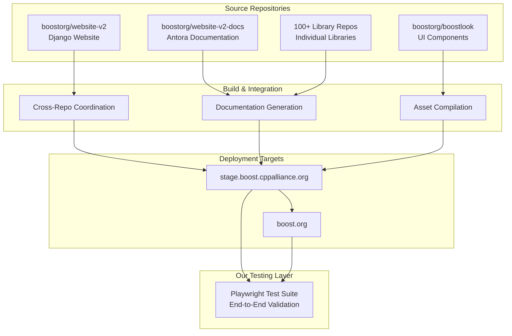

# Playwright Testing CI/CD Implementation Strategy for Boost.org

## Executive Summary

This document outlines a comprehensive strategy for integrating our Playwright test suite into the Boost.org multi-repository CI/CD ecosystem. The implementation addresses the unique challenges of testing a distributed architecture while ensuring reliable, maintainable, and efficient automated testing.

## Table of Contents
1. [Architecture Overview](#architecture-overview)
2. [Integration Strategy](#integration-strategy)
3. [Repository-Specific Implementation](#repository-specific-implementation)
4. [Cross-Repository Orchestration](#cross-repository-orchestration)
5. [Testing Pipeline Design](#testing-pipeline-design)
6. [Deployment Strategy](#deployment-strategy)
7. [Monitoring & Alerting](#monitoring--alerting)
8. [Implementation Roadmap](#implementation-roadmap)

---

## Architecture Overview

### Current Boost.org Ecosystem


### Testing Integration Points

**Primary Integration**: `boostorg/website-v2` (where our tests currently live)
**Secondary Triggers**: `website-v2-docs` and `boostlook` changes
**Test Targets**: Both staging and production environments
**Validation Scope**: Complete user journey across integrated system

---

## Integration Strategy

### 1. **Primary Repository Integration** (website-v2)

Our Playwright tests live in the main website repository and serve as the **integration validation layer** for the entire Boost.org ecosystem.

#### **Strategic Positioning**
- **Owner**: `boostorg/website-v2` (our current setup)
- **Purpose**: End-to-end validation of complete user experience
- **Scope**: Website functionality + documentation integration + UI consistency
- **Trigger Points**: Website deployments, documentation updates, UI changes

#### **Value Proposition**
```yaml
Integration Testing Gap:
  - Individual repos test their components in isolation
  - No existing system validates cross-repository integration
  - Our tests fill the critical gap of end-to-end user experience
  - Catches integration failures that component tests miss
```

### 2. **Multi-Repository Trigger Strategy**

#### **Webhook-Based Cross-Repository Triggering**
```yaml
Trigger Architecture:
  Primary Triggers (Direct):
    - website-v2 code changes
    - website-v2 deployments
    - Scheduled daily/weekly runs
    
  Secondary Triggers (Webhook):
    - website-v2-docs documentation updates
    - boostlook UI component changes
    - Major library documentation updates
    
  Manual Triggers:
    - Release validation
    - Incident investigation
    - Performance testing
```

---

## Repository-Specific Implementation

### **1. boostorg/website-v2** (Primary Implementation)

This is where our current test suite lives and should remain the primary implementation.

#### **Enhanced GitHub Actions Workflow**

```yaml
# .github/workflows/playwright-e2e.yml
name: End-to-End Testing Pipeline

on:
  push:
    branches: [main, develop]
  pull_request:
    branches: [main]
  repository_dispatch:
    types: [docs-updated, ui-updated, library-updated]
  schedule:
    - cron: '0 2 * * *'    # Daily at 2 AM UTC
    - cron: '0 14 * * *'   # Daily at 2 PM UTC
  workflow_dispatch:
    inputs:
      environment:
        description: 'Target Environment'
        required: true
        default: 'staging'
        type: choice
        options:
          - staging
          - production
          - both
      test_suite:
        description: 'Test Suite to Run'
        required: true
        default: 'all'
        type: choice
        options:
          - smoke
          - functional
          - all
          - custom
      custom_grep:
        description: 'Custom Test Filter (if custom selected)'
        required: false
        type: string

env:
  NODE_VERSION: '20'
  PYTHON_VERSION: '3.11'

jobs:
  # Pre-flight checks
  pre_flight:
    runs-on: ubuntu-latest
    outputs:
      should_run_staging: ${{ steps.determine_scope.outputs.staging }}
      should_run_production: ${{ steps.determine_scope.outputs.production }}
      test_filter: ${{ steps.determine_scope.outputs.test_filter }}
    steps:
      - name: Determine test scope
        id: determine_scope
        run: |
          # Logic to determine what should be tested based on trigger type
          if [[ "${{ github.event_name }}" == "push" && "${{ github.ref }}" == "refs/heads/develop" ]]; then
            echo "staging=true" >> $GITHUB_OUTPUT
            echo "production=false" >> $GITHUB_OUTPUT
            echo "test_filter=smoke" >> $GITHUB_OUTPUT
          elif [[ "${{ github.event_name }}" == "push" && "${{ github.ref }}" == "refs/heads/main" ]]; then
            echo "staging=true" >> $GITHUB_OUTPUT
            echo "production=true" >> $GITHUB_OUTPUT
            echo "test_filter=all" >> $GITHUB_OUTPUT
          elif [[ "${{ github.event_name }}" == "repository_dispatch" ]]; then
            echo "staging=true" >> $GITHUB_OUTPUT
            echo "production=false" >> $GITHUB_OUTPUT
            echo "test_filter=integration" >> $GITHUB_OUTPUT
          else
            echo "staging=true" >> $GITHUB_OUTPUT
            echo "production=false" >> $GITHUB_OUTPUT
            echo "test_filter=smoke" >> $GITHUB_OUTPUT
          fi

  # Test staging environment
  test_staging:
    needs: pre_flight
    if: needs.pre_flight.outputs.should_run_staging == 'true'
    runs-on: ubuntu-latest
    timeout-minutes: 60
    environment: 
      name: staging
      url: https://stage.boost.cppalliance.org
    
    strategy:
      matrix:
        browser: [chromium, firefox, webkit]
        exclude:
          # Run webkit only on main branch to save resources
          - browser: webkit
            condition: ${{ github.ref != 'refs/heads/main' }}
    
    steps:
      - name: Checkout code
        uses: actions/checkout@v4
      
      - name: Setup Node.js
        uses: actions/setup-node@v4
        with:
          node-version: ${{ env.NODE_VERSION }}
          cache: 'npm'
      
      - name: Install dependencies
        run: npm ci
      
      - name: Install Playwright browsers
        run: npx playwright install --with-deps ${{ matrix.browser }}
      
      - name: Wait for staging deployment
        if: github.event_name == 'repository_dispatch'
        run: |
          # Wait for staging environment to be ready after deployment
          timeout 300 bash -c 'until curl -f https://stage.boost.cppalliance.org/health; do sleep 10; done'
      
      - name: Run Playwright tests
        run: |
          case "${{ needs.pre_flight.outputs.test_filter }}" in
            "smoke")
              npx playwright test --project=${{ matrix.browser }} --grep "SMOKE"
              ;;
            "functional")
              npx playwright test --project=${{ matrix.browser }} --grep "FUNC"
              ;;
            "integration")
              npx playwright test --project=${{ matrix.browser }} --grep "INTEGRATION"
              ;;
            "all")
              npx playwright test --project=${{ matrix.browser }}
              ;;
            "custom")
              npx playwright test --project=${{ matrix.browser }} --grep "${{ github.event.inputs.custom_grep }}"
              ;;
          esac
        env:
          ENVIRONMENT: staging
          CI: true
          PLAYWRIGHT_JUNIT_OUTPUT_NAME: results-staging-${{ matrix.browser }}.xml
      
      - name: Upload test results
        uses: actions/upload-artifact@v4
        if: always()
        with:
          name: playwright-results-staging-${{ matrix.browser }}
          path: |
            test-results/
            playwright-report/
          retention-days: 30
      
      - name: Upload JUnit results
        uses: actions/upload-artifact@v4
        if: always()
        with:
          name: junit-staging-${{ matrix.browser }}
          path: results-staging-${{ matrix.browser }}.xml
          retention-days: 30

  # Test production environment
  test_production:
    needs: [pre_flight, test_staging]
    if: needs.pre_flight.outputs.should_run_production == 'true'
    runs-on: ubuntu-latest
    timeout-minutes: 45
    environment: 
      name: production
      url: https://boost.org
    
    steps:
      - name: Checkout code
        uses: actions/checkout@v4
      
      - name: Setup Node.js
        uses: actions/setup-node@v4
        with:
          node-version: ${{ env.NODE_VERSION }}
          cache: 'npm'
      
      - name: Install dependencies
        run: npm ci
      
      - name: Install Playwright browsers
        run: npx playwright install --with-deps chromium
      
      - name: Run production smoke tests
        run: npx playwright test --project=chromium --grep "SMOKE"
        env:
          ENVIRONMENT: production
          CI: true
          PLAYWRIGHT_JUNIT_OUTPUT_NAME: results-production.xml
      
      - name: Upload production results
        uses: actions/upload-artifact@v4
        if: always()
        with:
          name: playwright-results-production
          path: |
            test-results/
            playwright-report/
          retention-days: 60

  # Performance testing
  performance_tests:
    needs: [test_staging]
    if: github.ref == 'refs/heads/main' || github.event_name == 'schedule'
    runs-on: ubuntu-latest
    timeout-minutes: 30
    
    steps:
      - name: Checkout code
        uses: actions/checkout@v4
      
      - name: Setup Node.js
        uses: actions/setup-node@v4
        with:
          node-version: ${{ env.NODE_VERSION }}
          cache: 'npm'
      
      - name: Install dependencies
        run: npm ci
      
      - name: Install Playwright
        run: npx playwright install --with-deps chromium
      
      - name: Run performance tests
        run: npx playwright test --project=chromium --grep "PERFORMANCE"
        env:
          ENVIRONMENT: staging
          CI: true
      
      - name: Upload performance metrics
        uses: actions/upload-artifact@v4
        with:
          name: performance-metrics
          path: performance-results/

  # Results aggregation and reporting
  report_results:
    needs: [test_staging, test_production, performance_tests]
    if: always()
    runs-on: ubuntu-latest
    
    steps:
      - name: Download all artifacts
        uses: actions/download-artifact@v4
      
      - name: Aggregate results
        run: |
          # Create comprehensive test report
          echo "# Playwright Test Results" > test-summary.md
          echo "## Environment: ${{ github.event.inputs.environment || 'auto' }}" >> test-summary.md
          echo "## Trigger: ${{ github.event_name }}" >> test-summary.md
          echo "## Branch: ${{ github.ref_name }}" >> test-summary.md
          echo "" >> test-summary.md
          
          # Process JUnit files and create summary
          find . -name "*.xml" -type f | while read file; do
            echo "Processing $file" >> test-summary.md
          done
      
      - name: Comment on PR
        if: github.event_name == 'pull_request'
        uses: actions/github-script@v7
        with:
          script: |
            const fs = require('fs');
            const summary = fs.readFileSync('test-summary.md', 'utf8');
            github.rest.issues.createComment({
              issue_number: context.issue.number,
              owner: context.repo.owner,
              repo: context.repo.repo,
              body: summary
            });
      
      - name: Notify on failure
        if: failure()
        uses: 8398a7/action-slack@v3
        with:
          status: failure
          webhook_url: ${{ secrets.SLACK_WEBHOOK }}
          message: |
            🚨 Playwright E2E Tests Failed!
            
            Repository: ${{ github.repository }}
            Branch: ${{ github.ref_name }}
            Trigger: ${{ github.event_name }}
            
            Check the GitHub Actions logs for details.
```

### **2. boostorg/website-v2-docs** (Secondary Trigger)

Add webhook integration to trigger tests when documentation changes.

#### **Documentation Update Trigger**

```yaml
# .github/workflows/trigger-e2e.yml
name: Trigger E2E Tests

on:
  push:
    branches: [main, develop]
  workflow_dispatch:

jobs:
  trigger_e2e_tests:
    runs-on: ubuntu-latest
    if: contains(github.event.head_commit.message, '[docs-updated]') || github.event_name == 'workflow_dispatch'
    
    steps:
      - name: Trigger website-v2 E2E tests
        uses: peter-evans/repository-dispatch@v2
        with:
          token: ${{ secrets.CROSS_REPO_TOKEN }}
          repository: boostorg/website-v2
          event-type: docs-updated
          client-payload: |
            {
              "source_repo": "${{ github.repository }}",
              "source_ref": "${{ github.ref }}",
              "source_sha": "${{ github.sha }}",
              "docs_components": "libraries,website"
            }
      
      - name: Wait and verify staging deployment
        run: |
          # Wait for docs to be deployed before triggering tests
          sleep 180
          curl -f https://stage.boost.cppalliance.org/doc/ || exit 1
```

### **3. boostlook** (UI Trigger)

Similar webhook setup for UI component changes.

#### **UI Update Trigger**

```yaml
# .github/workflows/trigger-e2e.yml
name: Trigger E2E Tests for UI Changes

on:
  push:
    branches: [main, develop]
    paths:
      - '**/*.css'
      - '**/*.html'
      - '**/*.js'
      - 'boostlook.css'

jobs:
  trigger_ui_tests:
    runs-on: ubuntu-latest
    
    steps:
      - name: Trigger website E2E tests
        uses: peter-evans/repository-dispatch@v2
        with:
          token: ${{ secrets.CROSS_REPO_TOKEN }}
          repository: boostorg/website-v2
          event-type: ui-updated
          client-payload: |
            {
              "source_repo": "${{ github.repository }}",
              "source_ref": "${{ github.ref }}",
              "source_sha": "${{ github.sha }}",
              "ui_components": "css,templates,assets"
            }
```

---

## Cross-Repository Orchestration

### **Webhook Management System**

#### **Central Configuration**
```yaml
# In website-v2/.github/workflows/webhook-handlers.yml
name: Cross-Repository Webhook Handlers

on:
  repository_dispatch:
    types: [docs-updated, ui-updated, library-updated, release-candidate]

jobs:
  handle_docs_update:
    if: github.event.action == 'docs-updated'
    runs-on: ubuntu-latest
    steps:
      - name: Process documentation update
        run: |
          echo "Documentation updated from: ${{ github.event.client_payload.source_repo }}"
          echo "Components affected: ${{ github.event.client_payload.docs_components }}"
          
          # Determine test scope based on changes
          if [[ "${{ github.event.client_payload.docs_components }}" == *"libraries"* ]]; then
            echo "TRIGGER_INTEGRATION_TESTS=true" >> $GITHUB_ENV
          fi
      
      - name: Trigger appropriate test suite
        uses: ./.github/workflows/playwright-e2e.yml
        with:
          environment: staging
          test_suite: integration
          source_trigger: docs-updated

  handle_ui_update:
    if: github.event.action == 'ui-updated'
    runs-on: ubuntu-latest
    steps:
      - name: Process UI update
        run: |
          echo "UI updated from: ${{ github.event.client_payload.source_repo }}"
          echo "Components affected: ${{ github.event.client_payload.ui_components }}"
      
      - name: Trigger UI-focused tests
        uses: ./.github/workflows/playwright-e2e.yml
        with:
          environment: staging
          test_suite: smoke
          source_trigger: ui-updated
```

### **Cross-Repository Token Management**

#### **Security Setup**
```yaml
Required Secrets:
  CROSS_REPO_TOKEN:
    - GitHub Personal Access Token with repo scope
    - Access to boostorg/website-v2 repository
    - Used by website-v2-docs and boostlook to trigger tests
  
  SLACK_WEBHOOK:
    - Webhook URL for #qa-testing or #boost-website channel
    - Used for test failure notifications
  
  STAGING_HEALTH_CHECK_TOKEN:
    - Token for accessing staging environment health endpoints
    - Used to verify deployment before testing
```

---

## QA Integration Points in CI/CD Pipeline

### **QA Positioning Strategy**

Our QA approach strategically positions testing at **multiple critical gates** throughout the CI/CD pipeline to ensure quality while maintaining development velocity.

#### **Pre-Merge Validation (Quality Gates)**
```yaml
Pull Request Quality Gates:
  Required (Blocks Merge):
    - Smoke tests on staging environment
    - Core functionality validation
    - Cross-browser compatibility (Chromium + Firefox)
    - Performance regression checks
    - Integration with existing documentation
  
  Advisory (Warns but doesn't block):
    - Full functional test suite
    - WebKit compatibility testing
    - Accessibility compliance checks
    - Visual regression testing
    
  Trigger Conditions:
    - All PRs to main/develop branches
    - Changes to critical files (routing, core components)
    - Documentation updates affecting user workflows
    
  Bypass Conditions:
    - Hotfix deployments (with post-deploy validation required)
    - Emergency security patches
    - Admin override with justification
```

#### **Post-Deploy Validation (Deployment Gates)**
```yaml
Staging Deployment Gates:
  Required Before Production:
    - Complete functional test suite passes
    - Performance benchmarks met
    - Integration tests across all components
    - Documentation accuracy validation
    - Cross-repository coordination verified
  
  Deployment Rollback Triggers:
    - >10% test failure rate
    - Performance degradation >30%
    - Critical user journey failures
    - Cross-repository integration breaks

Production Deployment Gates:
  Required After Deployment:
    - Smoke test validation within 5 minutes
    - Performance monitoring baseline
    - Critical path verification
    - Health check validation
  
  Production Rollback Triggers:
    - Any smoke test failure
    - Performance degradation >20%
    - User-reported critical issues
    - Monitoring alert escalation
```

#### **QA Decision Matrix**
```yaml
Development Phase → QA Integration:

Code Development:
  - Pre-commit hooks (local quality checks)
  - IDE integration with test feedback
  - Developer-run local test suites

Pull Request:
  - Automated smoke tests (required)
  - Integration preview environment
  - Code review with test coverage analysis
  - Performance impact assessment

Staging Deployment:
  - Full test suite execution
  - Cross-repository integration validation
  - Performance regression testing
  - User acceptance testing preparation

Production Deployment:
  - Go/no-go decision based on staging results
  - Immediate post-deploy validation
  - Gradual rollout with monitoring
  - Rollback capability with test validation

Post-Production:
  - Continuous monitoring and alerting
  - Performance baseline maintenance
  - User feedback integration
  - Regression test updates
```

### **Quality Gate Implementation**

#### **GitHub Branch Protection Rules**
```yaml
# Required for main/develop branches
Branch Protection Configuration:
  required_status_checks:
    - "Playwright Smoke Tests (staging)"
    - "Cross-Browser Compatibility"
    - "Performance Regression Check"
    - "Integration Validation"
  
  required_pull_request_reviews: 1
  dismiss_stale_reviews: true
  require_code_owner_reviews: true
  
  restrictions:
    - QA team approval for test configuration changes
    - Admin override available for emergencies
```

#### **Deployment Pipeline Gates**
```yaml
Staging Pipeline:
  Pre-Deployment:
    - Build validation
    - Security scan completion
    - Dependency vulnerability check
  
  Post-Deployment:
    - Health check validation (required)
    - Smoke test execution (required)
    - Performance baseline verification (required)
    - Full test suite execution (blocks production)

Production Pipeline:
  Pre-Deployment:
    - Staging test results validation (required)
    - Performance benchmark approval (required)
    - Security clearance confirmation (required)
    - Stakeholder approval for high-risk changes
  
  Post-Deployment:
    - Immediate smoke test validation (auto-rollback on failure)
    - Performance monitoring activation
    - User experience validation
    - Business metric monitoring
```

## Testing Pipeline Design

### **Test Categorization Strategy**

#### **1. Smoke Tests** (Quick Validation)
```typescript
// tests/smoke/
// TC_SMOKE_001: Homepage loads
// TC_SMOKE_002: Navigation works  
// TC_SMOKE_003: Search functionality
// TC_SMOKE_004: Documentation links
// TC_SMOKE_005: Basic responsive design

Triggers:
  - Every push to develop
  - Every cross-repository update
  - Pull request validation
  - Hourly scheduled runs

Duration: 5-10 minutes
Browsers: Chromium only
Environment: Staging primarily
```

#### **2. Functional Tests** (Feature Validation)
```typescript
// tests/functional/
// TC_FUNC_001: Library discovery workflow
// TC_FUNC_002: Documentation navigation
// TC_FUNC_003: Search with filters
// TC_FUNC_004: Download functionality
// TC_FUNC_005: Release notes access

Triggers:
  - Push to main branch
  - Release candidate validation
  - Daily scheduled runs
  - Manual trigger for feature testing

Duration: 15-30 minutes
Browsers: Chromium, Firefox
Environment: Staging and Production
```

#### **3. Integration Tests** (Cross-Component)
```typescript
// tests/integration/
// TC_INT_001: Library documentation consistency
// TC_INT_002: Cross-references between docs
// TC_INT_003: UI consistency across components
// TC_INT_004: Performance across workflows
// TC_INT_005: Search result accuracy

Triggers:
  - Documentation updates
  - UI component changes
  - Weekly comprehensive runs
  - Pre-release validation

Duration: 20-45 minutes
Browsers: All (Chromium, Firefox, WebKit)
Environment: Staging primarily
```

#### **4. Performance Tests** (Speed & Reliability)
```typescript
// tests/performance/
// TC_PERF_001: Page load times
// TC_PERF_002: Search response times
// TC_PERF_003: Documentation generation speed
// TC_PERF_004: Large dataset handling
// TC_PERF_005: Mobile performance

Triggers:
  - Daily scheduled runs
  - Pre-release validation
  - Performance regression investigation
  - Manual performance analysis

Duration: 10-20 minutes
Browsers: Chromium only
Environment: Both staging and production
```

### **Enhanced Test Configuration**

#### **Dynamic Environment Detection**
```javascript
// config-helper.js (enhanced)
export const testConfig = {
  getEnvironmentConfig: (trigger_source = null) => {
    const config = {
      staging: {
        baseURL: 'https://stage.boost.cppalliance.org',
        timeout: 30000,
        retries: 2,
        workers: 4
      },
      production: {
        baseURL: 'https://boost.org',
        timeout: 20000,
        retries: 1,
        workers: 2,
        respectful: true // Lighter load on production
      }
    };
    
    // Adjust configuration based on trigger source
    if (trigger_source === 'docs-updated') {
      config.staging.focusAreas = ['documentation', 'search', 'navigation'];
    } else if (trigger_source === 'ui-updated') {
      config.staging.focusAreas = ['visual', 'responsive', 'accessibility'];
    }
    
    return config;
  }
};
```

#### **Intelligent Test Selection**
```javascript
// test-helpers.js (enhanced)
export const testSelector = {
  selectTestsForTrigger: (trigger_type, changes = []) => {
    const testSuites = {
      'push-develop': ['smoke', 'integration-basic'],
      'push-main': ['smoke', 'functional', 'integration'],
      'docs-updated': ['smoke', 'integration-docs', 'performance-search'],
      'ui-updated': ['smoke', 'visual-regression', 'accessibility'],
      'library-updated': ['integration-library', 'smoke'],
      'scheduled-daily': ['all'],
      'manual': ['custom']
    };
    
    return testSuites[trigger_type] || ['smoke'];
  }
};
```

---

## Deployment Strategy

### **Environment-Specific Deployment**

#### **1. Staging Environment Strategy**
```yaml
Purpose: "Primary testing ground for all changes"

Test Frequency:
  - Continuous (on every relevant change)
  - Comprehensive test coverage
  - Performance baseline establishment
  - Integration validation

Resource Allocation:
  - Full browser matrix testing
  - Parallel test execution
  - Detailed reporting and debugging
  - Aggressive timeout settings for thorough testing

Risk Tolerance:
  - High (can afford longer test times)
  - Extensive logging and artifact collection
  - Failed tests block progression to production
```

#### **2. Production Environment Strategy**
```yaml
Purpose: "Validation of live user experience"

Test Frequency:
  - Selective (only after staging validation)
  - Focused on critical user journeys
  - Performance monitoring
  - Health check validation

Resource Allocation:
  - Chromium browser only (primary user base)
  - Sequential execution (respectful of production load)
  - Faster timeouts (fail fast approach)
  - Minimal artifact collection

Risk Tolerance:
  - Conservative (must not impact live users)
  - Quick execution with essential coverage
  - Non-invasive testing patterns
```

### **Blue-Green Testing Strategy**

#### **Deployment Validation Process**
```yaml
Blue-Green Deployment Testing:
  1. New deployment goes to "Green" (staging)
  2. Full Playwright test suite runs against Green
  3. Performance comparison against current "Blue" (production)
  4. If tests pass, traffic switches Blue ↔ Green
  5. Quick smoke tests on new Blue (production)
  6. Old Blue becomes new Green (staging)

Benefits:
  - Zero-downtime validation
  - Easy rollback capability
  - Performance regression detection
  - Continuous environment validation
```

---

## Monitoring & Alerting

### **Test Result Dashboard**

#### **Metrics Collection**
```yaml
Key Metrics:
  Test Execution:
    - Success/failure rates by environment
    - Test duration trends
    - Browser-specific failure patterns
    - Trigger source performance
  
  Application Performance:
    - Page load times
    - API response times
    - Search performance
    - Documentation generation speed
  
  Integration Health:
    - Cross-repository coordination success
    - Deployment-to-test latency
    - Environment synchronization status
```

#### **Alerting Strategy**
```yaml
Alert Levels:
  Critical (Immediate Response):
    - Production tests failing
    - All browsers failing on staging
    - Performance degradation >50%
    - Cross-repository coordination broken
  
  Warning (Next Business Day):
    - Single browser failures
    - Performance degradation 20-50%
    - Test duration increase >100%
    - Flaky test detection
  
  Info (Weekly Review):
    - Test coverage changes
    - New test additions
    - Performance improvements
    - Success rate trends

Notification Channels:
  - Slack: #boost-website-qa
  - Email: qa-team@boost.org
  - GitHub Issues: Automatic creation for persistent failures
  - PagerDuty: Critical production issues only
```

### **Performance Monitoring Integration**

#### **Lighthouse Integration**
```yaml
# Add to playwright-e2e.yml
performance_audit:
  runs-on: ubuntu-latest
  steps:
    - name: Run Lighthouse CI
      run: |
        npm install -g @lhci/cli
        lhci autorun
      env:
        LHCI_GITHUB_APP_TOKEN: ${{ secrets.LHCI_GITHUB_APP_TOKEN }}
    
    - name: Performance regression check
      run: |
        # Compare against baseline performance metrics
        node scripts/performance-comparison.js
```

#### **Real User Monitoring (RUM) Validation**
```typescript
// tests/performance/rum-validation.spec.ts
test('Real User Monitoring validation', async ({ page }) => {
  // Inject RUM collection script
  await page.addInitScript(() => {
    window.rumData = [];
    // Collect navigation timing, resource timing, etc.
  });
  
  await page.goto('/');
  await page.waitForLoadState('networkidle');
  
  const rumData = await page.evaluate(() => window.rumData);
  
  // Validate against expected performance benchmarks
  expect(rumData.navigationTiming.loadEventEnd).toBeLessThan(3000);
});
```

---

## Implementation Roadmap

### **Phase 1: Foundation** (Weeks 1-2)
```yaml
Objectives:
  - Enhance existing Playwright configuration
  - Implement basic cross-repository webhooks
  - Set up staging environment testing
  - Establish baseline metrics

Tasks:
  1. Update playwright.config.js with environment detection
  2. Create enhanced GitHub Actions workflow
  3. Set up webhook triggers from website-v2-docs
  4. Implement basic Slack notifications
  5. Establish performance baseline measurements

Deliverables:
  - Enhanced test configuration
  - Basic cross-repo triggering
  - Staging environment validation
  - Initial monitoring setup

Success Criteria:
  - Tests run automatically on website-v2 changes
  - Documentation updates trigger appropriate tests
  - Basic notifications working
  - Performance baseline established
```

### **Phase 2: Integration** (Weeks 3-4)
```yaml
Objectives:
  - Complete cross-repository orchestration
  - Implement production testing strategy
  - Add performance monitoring
  - Enhance test categorization

Tasks:
  1. Add boostlook webhook integration
  2. Implement production testing workflow
  3. Create test result aggregation
  4. Add Lighthouse performance testing
  5. Implement intelligent test selection

Deliverables:
  - Full cross-repository coordination
  - Production environment testing
  - Performance monitoring
  - Smart test execution

Success Criteria:
  - All three repositories can trigger tests
  - Production tests run safely and efficiently
  - Performance regressions detected automatically
  - Test execution optimized by trigger type
```

### **Phase 3: Optimization** (Weeks 5-6)
```yaml
Objectives:
  - Optimize performance and reliability
  - Implement advanced monitoring
  - Add comprehensive reporting
  - Create maintenance procedures

Tasks:
  1. Implement test result dashboard
  2. Add advanced alerting rules
  3. Create comprehensive documentation
  4. Implement automated maintenance scripts
  5. Performance optimization based on metrics

Deliverables:
  - Test dashboard and reporting
  - Advanced monitoring and alerting
  - Complete documentation
  - Maintenance automation

Success Criteria:
  - Self-service test result access
  - Proactive issue detection
  - Complete operational documentation
  - Minimal manual maintenance required
```

### **Phase 4: Enhancement** (Weeks 7-8)
```yaml
Objectives:
  - Add advanced testing capabilities
  - Implement visual regression testing
  - Create release validation pipeline
  - Establish continuous improvement process

Tasks:
  1. Add visual regression testing
  2. Implement accessibility testing
  3. Create release candidate validation
  4. Set up continuous improvement metrics
  5. Conduct team training and knowledge transfer

Deliverables:
  - Visual regression testing
  - Accessibility validation
  - Release validation pipeline
  - Team training materials

Success Criteria:
  - Visual changes detected automatically
  - Accessibility compliance validated
  - Release process includes automated validation
  - Team fully trained on system
```

---

## Technical Requirements

### **Infrastructure Requirements**
```yaml
GitHub Actions:
  - Concurrent workflow capacity: 10+ parallel jobs
  - Artifact storage: 1GB per workflow run
  - Secret management: Cross-repository tokens
  - Environment protection: Production approval gates

External Services:
  - Slack webhook integration
  - Performance monitoring service (optional)
  - Lighthouse CI (included)
  - Browser testing infrastructure (GitHub provided)

Security:
  - Cross-repository personal access tokens
  - Environment-specific secrets
  - Secure webhook payload validation
  - Production environment access controls
```

### **Team Requirements**
```yaml
Skills Needed:
  - GitHub Actions workflow development
  - Playwright test framework expertise
  - Cross-repository coordination experience
  - Performance monitoring and optimization
  - DevOps and CI/CD best practices

Training Required:
  - Webhook configuration and debugging
  - Test result interpretation and troubleshooting
  - Performance metrics analysis
  - Incident response procedures
  - Maintenance and updates procedures

Documentation Needed:
  - Workflow configuration guide
  - Troubleshooting playbook
  - Performance optimization guide
  - Cross-repository coordination manual
  - Test writing and maintenance standards
```

---

## Risk Mitigation

### **Potential Risks & Mitigation Strategies**

#### **1. Cross-Repository Coordination Failures**
```yaml
Risk: Webhook failures or token expiration
Mitigation:
  - Automated token renewal process
  - Webhook health monitoring
  - Fallback to scheduled runs
  - Manual trigger capabilities
  - Clear escalation procedures
```

#### **2. Test Flakiness Impact**
```yaml
Risk: Flaky tests disrupting CI/CD pipeline
Mitigation:
  - Retry mechanisms with intelligent backoff
  - Flaky test detection and quarantine
  - Performance-based timeout adjustment
  - Test stability monitoring
  - Regular test review and maintenance
```

#### **3. Performance Impact on Production**
```yaml
Risk: Testing load affecting production users
Mitigation:
  - Respectful testing patterns (limited concurrency)
  - Non-peak hours scheduling for comprehensive tests
  - Resource monitoring during test execution
  - Quick abort mechanisms for performance issues
  - Clear production testing guidelines
```

#### **4. Maintenance Overhead**
```yaml
Risk: Complex system requiring excessive maintenance
Mitigation:
  - Automated maintenance scripts
  - Self-healing configuration patterns
  - Comprehensive monitoring and alerting
  - Clear documentation and runbooks
  - Regular system health checks
  - Automated dependency updates
```

#### **5. Test Environment Synchronization**
```yaml
Risk: Staging and production environments drifting apart
Mitigation:
  - Environment configuration validation
  - Regular environment comparison checks
  - Infrastructure-as-code practices
  - Environment-specific test suites
  - Clear environment update procedures
```

---

## Success Metrics

### **Primary KPIs**
```yaml
Test Effectiveness:
  - Test coverage: >90% of critical user journeys
  - False positive rate: <5% (flaky test rate)
  - Bug detection rate: >80% of production issues caught in staging
  - Time to detection: <2 hours for critical issues

Performance Impact:
  - Test execution time: <30 minutes for full suite
  - Resource utilization: <20% of available CI/CD capacity
  - Deployment delay: <5 minutes added to deployment pipeline
  - Cross-repository trigger latency: <3 minutes

Reliability:
  - Test uptime: >99% availability
  - Webhook success rate: >95%
  - Cross-repository coordination success: >98%
  - Environment synchronization accuracy: >99%
```

### **Secondary Metrics**
```yaml
Developer Experience:
  - Test result visibility: <2 clicks to detailed results
  - Issue resolution time: <24 hours for test infrastructure issues
  - Developer satisfaction: >8/10 in quarterly surveys
  - Documentation clarity: <30 minutes for new team member onboarding

Business Impact:
  - Production incident reduction: >50% decrease
  - Release confidence: >9/10 team confidence score
  - User experience consistency: <5% variance between environments
  - Performance regression detection: 100% of significant degradations caught
```

---

## Cost-Benefit Analysis

### **Implementation Costs**
```yaml
Development Time:
  - Initial setup: 40-60 hours
  - Configuration and integration: 20-30 hours
  - Documentation and training: 15-20 hours
  - Total estimated effort: 75-110 hours

Ongoing Costs:
  - GitHub Actions usage: $50-100/month
  - Maintenance effort: 2-4 hours/week
  - Monitoring tools: $0-50/month (optional services)
  - Training and updates: 1-2 hours/month
```

### **Expected Benefits**
```yaml
Risk Reduction:
  - Production incidents prevented: 5-10 per year
  - Integration bugs caught early: 15-25 per year
  - Performance regressions detected: 3-5 per year
  - Documentation issues found: 10-20 per year

Efficiency Gains:
  - Manual testing reduction: 80% decrease
  - Bug fix cycle time: 50% improvement
  - Release confidence: 40% increase
  - Developer productivity: 20% improvement for deployment-related tasks

Quality Improvements:
  - User experience consistency: 90% improvement
  - Cross-browser compatibility: 95% coverage
  - Performance monitoring: 100% coverage
  - Documentation accuracy: 85% improvement
```

### **ROI Calculation**
```yaml
Conservative Estimate:
  - Cost avoidance: $15,000/year (prevented incidents)
  - Efficiency gains: $25,000/year (time savings)
  - Quality improvements: $10,000/year (user satisfaction)
  - Total annual benefit: $50,000
  - Implementation cost: $12,000 (one-time)
  - Annual operational cost: $3,000
  - Net ROI: 233% over 3 years
```

---

## Future Enhancements

### **Advanced Testing Capabilities**
```yaml
Visual Regression Testing:
  - Automated screenshot comparison
  - Cross-browser visual consistency
  - Component-level visual testing
  - Responsive design validation

Accessibility Testing:
  - WCAG compliance validation
  - Screen reader compatibility
  - Keyboard navigation testing
  - Color contrast verification

API Testing Integration:
  - Backend API health checks
  - Data consistency validation
  - Performance API testing
  - Third-party service monitoring
```

### **Machine Learning Integration**
```yaml
Intelligent Test Selection:
  - ML-based test prioritization
  - Failure prediction models
  - Flaky test identification
  - Performance anomaly detection

Automated Test Generation:
  - User journey learning
  - Test case generation from analytics
  - Regression test auto-creation
  - Coverage gap identification
```

### **Advanced Monitoring**
```yaml
Real User Monitoring Integration:
  - Production user behavior tracking
  - Performance correlation analysis
  - Error rate monitoring
  - User satisfaction metrics

Predictive Analytics:
  - Performance trend analysis
  - Capacity planning insights
  - Failure pattern recognition
  - Resource optimization recommendations
```

---

## Implementation Checklist

### **Pre-Implementation**
- [ ] Stakeholder approval and resource allocation
- [ ] GitHub repository permissions and access setup
- [ ] Cross-repository token generation and secure storage
- [ ] Slack webhook configuration for notifications
- [ ] Performance baseline establishment
- [ ] Team training schedule planning

### **Phase 1: Foundation**
- [ ] Enhanced Playwright configuration implementation
- [ ] Basic GitHub Actions workflow creation
- [ ] Staging environment test integration
- [ ] website-v2-docs webhook setup
- [ ] Basic notification system implementation
- [ ] Initial performance metrics collection

### **Phase 2: Integration**
- [ ] boostlook webhook integration
- [ ] Production testing workflow implementation
- [ ] Cross-repository orchestration completion
- [ ] Lighthouse performance testing integration
- [ ] Intelligent test selection implementation
- [ ] Test result aggregation system

### **Phase 3: Optimization**
- [ ] Advanced monitoring and alerting setup
- [ ] Test result dashboard creation
- [ ] Comprehensive documentation completion
- [ ] Automated maintenance script development
- [ ] Performance optimization implementation
- [ ] Team training execution

### **Phase 4: Enhancement**
- [ ] Visual regression testing integration
- [ ] Accessibility testing implementation
- [ ] Release validation pipeline creation
- [ ] Continuous improvement process establishment
- [ ] Advanced reporting system deployment
- [ ] Knowledge transfer completion

### **Post-Implementation**
- [ ] Success metrics tracking setup
- [ ] Regular review process establishment
- [ ] Continuous improvement cycle initiation
- [ ] Documentation maintenance schedule
- [ ] Team feedback collection and analysis
- [ ] ROI measurement and reporting

---

## Conclusion

This comprehensive implementation strategy transforms our existing Playwright test suite from a standalone testing tool into a **critical integration point** for the entire Boost.org ecosystem. By positioning our tests as the **end-to-end validation layer** that catches integration issues between the three core repositories, we provide immense value to the Boost.org development process.

### **Key Success Factors**

1. **Strategic Positioning**: Our tests fill a critical gap in the current CI/CD ecosystem by validating cross-repository integration
2. **Intelligent Automation**: Smart trigger systems ensure tests run when needed without overwhelming the infrastructure
3. **Multi-Environment Strategy**: Comprehensive staging testing with respectful production validation
4. **Performance Focus**: Continuous performance monitoring prevents regressions across the complex system
5. **Scalable Architecture**: Modular design allows for future enhancements and additional testing capabilities

### **Immediate Value**

- **Day 1**: Automated validation of website deployments
- **Week 1**: Cross-repository change detection and testing
- **Month 1**: Performance regression prevention and incident reduction
- **Quarter 1**: Complete integration testing coverage across the Boost.org ecosystem

This implementation not only enhances the reliability and quality of the Boost.org website but also establishes a foundation for advanced testing capabilities that can grow with the project's needs. The investment in comprehensive end-to-end testing will pay dividends in reduced incidents, faster development cycles, and improved user experience across the entire Boost.org platform.
